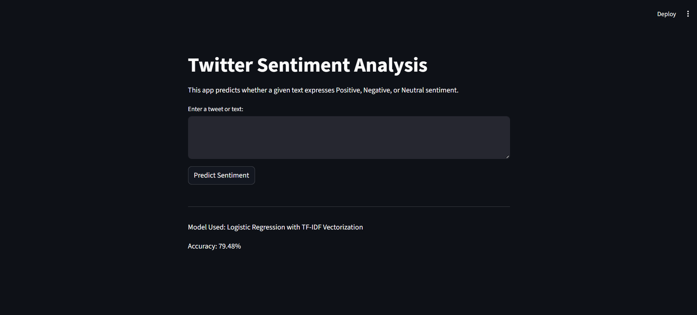
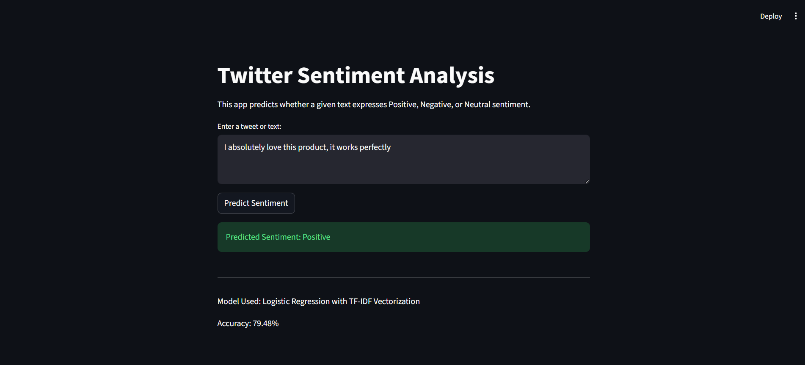
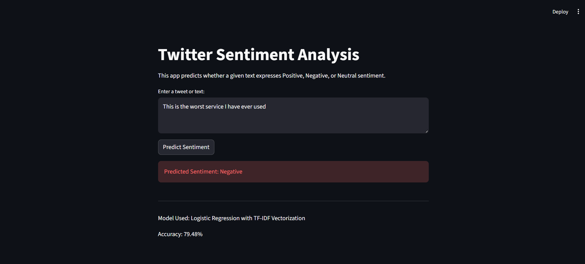
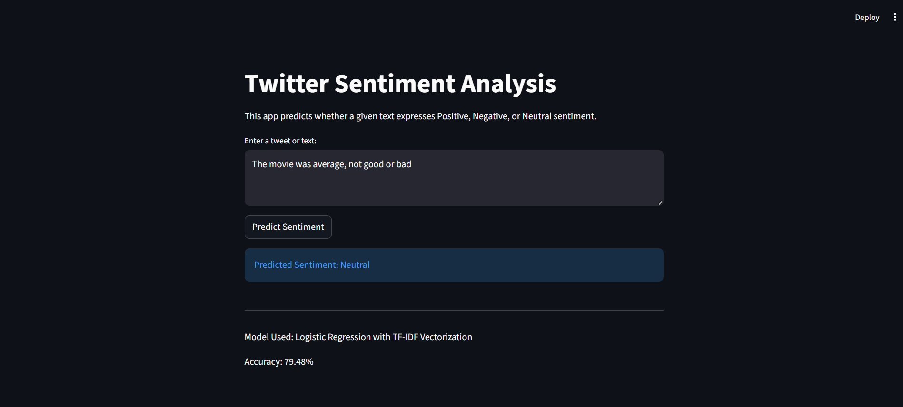

# Twitter Sentiment Analysis using NLP and Machine Learning

## Project Overview
This project is a machine learning-based sentiment analysis system that classifies text or tweets into Positive, Negative, and Neutral sentiments. The project uses Natural Language Processing techniques for text preprocessing and TF-IDF vectorization, followed by machine learning models for classification.

## Objective
The main objective of this project is to analyze textual data and predict the sentiment expressed in the text. It helps in understanding public opinion, customer feedback, and social media reactions.

## Dataset
The dataset used for this project is the Twitter Entity Sentiment Analysis dataset from Kaggle. It contains tweets labeled with sentiments such as Positive, Negative, Neutral, and Irrelevant. The Irrelevant class was removed to focus on three-class sentiment classification.

Dataset Link: https://www.kaggle.com/datasets/jp797498e/twitter-entity-sentiment-analysis

## Technologies Used
- Python
- Pandas
- NumPy
- Scikit-learn
- Matplotlib
- Seaborn
- Streamlit
- Natural Language Processing

## Methodology
1. Loaded the Twitter sentiment dataset.
2. Removed unnecessary columns and irrelevant sentiment class.
3. Cleaned text data by removing URLs, mentions, hashtags, punctuation, numbers, and extra spaces.
4. Converted text into numerical features using TF-IDF Vectorization with unigram and bigram features.
5. Split the dataset into training and testing sets.
6. Trained Logistic Regression and Naive Bayes models.
7. Compared model performance using accuracy and classification reports.
8. Saved the best-performing model for deployment.
9. Built a Streamlit web app for real-time sentiment prediction.

## Model Performance

| Model | Accuracy |
|---|---|
| Logistic Regression | 79.48% |
| Naive Bayes | 74.07% |

The Logistic Regression model performed better and was selected as the final model.

## Features
- Predicts sentiment as Positive, Negative, or Neutral
- Text preprocessing and cleaning
- TF-IDF feature extraction
- Model comparison
- Confusion matrix visualization
- Real-time prediction using Streamlit

## Application Screenshots

### Home Page


### Positive Sentiment Prediction


### Negative Sentiment Prediction


### Neutral Sentiment Prediction


## Sample Predictions

| Input Text | Predicted Sentiment |
|---|---|
| I absolutely love this product, it works perfectly | Positive |
| This is the worst service I have ever used | Negative |
| The update is available today | Negative |
| The movie was average, not good or bad | Neutral |

## How to Run the Project

1. Clone the repository:
```bash
git clone https://github.com/your-username/Twitter-Sentiment-Analysis.git

cd Twitter-Sentiment-Analysis

2. Install the required dependencies:

pip install -r requirements.txt

3. Run the Streamlit application 

streamlit run app.py

4. Enter any tweet or text in the input box and click on the Predict Sentiment button to get the predicted sentiment.

## Project Structure

```text
Twitter-Sentiment-Analysis/
│
├── app.py
├── README.md
├── requirements.txt
├── sentiment_model.pkl
├── tfidf_vectorizer.pkl
├── Notebook/
│   └── Sentiment_Analysis.ipynb
└── Screenshots/
    ├── Home_Page.png
    ├── Positive_Result.png
    ├── Negative_Result.png
    └── Neutral_Result.png

Results

The Logistic Regression model performed better than the Naive Bayes model.

| Model               | Accuracy |
| ------------------- | -------- |
| Logistic Regression | 79.48%   |
| Naive Bayes         | 74.07%   |


Conclusion

This project successfully demonstrates sentiment classification using Natural Language Processing and Machine Learning. The text data was cleaned and converted into numerical features using TF-IDF Vectorization. Two machine learning models, Logistic Regression and Naive Bayes, were trained and evaluated.

Logistic Regression achieved the highest accuracy of 79.48% and was selected as the final model. The model performs well on clear positive and negative text, while neutral or ambiguous text can be more challenging to classify.

Future Scope

Improve sentiment classification using deep learning models such as LSTM or BERT
Add support for multilingual sentiment analysis
Improve handling of sarcasm and mixed emotions
Deploy the application on Streamlit Cloud
Add more visualizations and analytics for sentiment trends

Author

Sahas Bochare

Acknowledgement

This project was developed as part of the Artificial Intelligence Internship at Codec Technologies.
